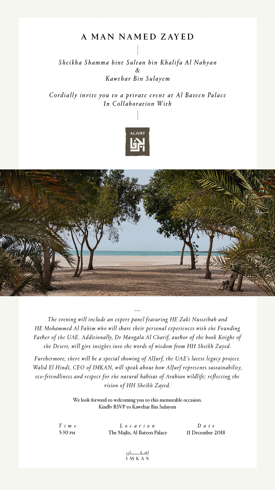

<video autoplay loop muted playsinline poster="resources/adbf.jpg" preload="auto">
    <source src="resources/events.webm" type="video/webm">
    <source src="resources/events.mp4" type="video/mp4">
    Your device doesn't support this video.
</video>

إطلاق النسخة العربية من كتاب "فارس الصحراء" ضمن فعاليات معرض أبوظبي الدولي للكتاب

شهد حفل الإطلاق معالي الشيخ نهيان بن مبارك آل نهيان وزير التسامح، ومعالي الشيخة لبنى القاسمي، والشيخ أحمد بن سلطان بن صقر القاسمي، والشيخ ذياب بن خليفة بن شخبوط آل نهيان، ونفديب سينغ سوري سفير جمهورية الهند لدى الدولة

{:.no_margins}

كما حضر الحفل، معالي الدكتور سعيد أحمد غباش الرئيس الأعلى لجامعة الإمارات، ومبارك الشامسي مدير عام مركز أبوظبي للتعليم والتدريب التقني والمهني، وميثاء الحبسي الرئيس التنفيذي لمؤسسة الإمارات، ومحمد سالم الظاهري مستشار رئيس دائرة التعليم والمعرفة، ودينا عساف منسقة الأمم المتحدة، والدكتور سليمان الهتلان المؤسس والرئيس التنفيذي لشركة هتلان ميديا، وعدد من الكتاب والأدباء والمفكرين

{:.multicols.fullheight}

