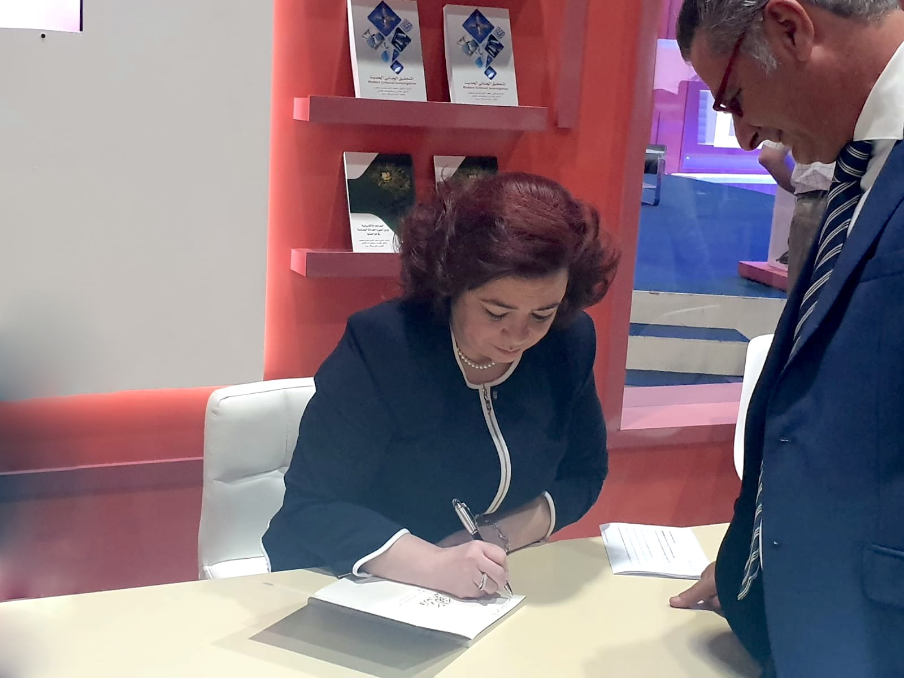

{:.quote}

{:.no_margins}

{:.quote}

# المقدمة

التعابير كالحلي منها النفيس الأصيل ومنها الزائف، وأقوال الشيخ زايد بن سلطان آل نهيان رئيس الدولة – رحمه الله – نصّ ٳبداعيّ فنّي فريد ترتسم فيه بنية القائد المعرفية وملامح تكوينه الثقافي الخاص، وتتداخل فيه حدود الفلسفة والدين. هذه الدراسة محاولة متواضعة للنفاذ ٳلى ما وراء السطح والكشف عن العمق المعرفي والبعد الفلسفي والسيكولوجي لأقوال غنيّة الدلالة رغم بساطة التعبير. إنها لا تعتمد منهجاً تقليدياً في البحث، بل هي قراءة خاصّة لعدد من الأقوال الّتي لم تؤخذ وفق تسلسلها الزّمني وإنما حسب بعض المواضيع التي تناولها القائد الراحل: الصّحراء، والمدينة، والحرية، والعلم، والبترول، والشباب، والتراث، والدين، والموروث الثقافي، والعالم، والإنسان، والمرأة، والاتحاد، الخ... ويجدر التنبيه هنا إلى أنني اتخذت حقي المشروع كناقدة في انتقاء بعض الأقوال الّتي تركت فيّ أثراً خاصاً. والهدف من ذلك استجلاء "البنية المعرفية" الّتي تكشف عنها الأقوال. ولا بد هنا من الإشارة إلى أنني توخيت المنهج العلمي في التحليل، مُتحررة من الأحكام المسبقة، لا يحركني إلا هاجس البحث عن المعنى. وقد شجعني على ذلك قوله بحرية الرأي ومناداته إلى ممارسة هذا الفعل كحق مكتسب للناقد. يقول الشيخ زايد رحمه الله: "من واجب الصحافة ومن حقها أن تنتقد، ونحن نرحب بالنقد البنّاء."

"إننا نؤمن إيماناً عميقاً بحرية الصحافة ونحن جميعاً شركاء في الرأي وفي السياسة وفي التخطيط وفي الإعداد وفي التنفيذ وبدون هذه المشاركة لا يكون للعمل الوطني معنى أو محتوى."

وقال طيّب الله ثراه: "الصحيفة هي مرآة المجتمع، وحريتها في التعبير عن رأيها امتداد لحرية الإنسان وحقه الطبيعي في التعبير عن رأيه. إن الصحيفة يجب أن تكون حرة كي تعبر بصدق وإخلاص عن رأي الناس، ولكي تخدم الشعب، وإذا فقدت أي صحيفة حريتها فقدت حياتها وماتت، فحرية الصحيفة مرتبطة بحرية الفرد، وبالتالي حرية المجتمع ككل، وعندما تصدر الصحف اليومية عندنا ستتمتع بحريتها الكاملة في التعبير عن رأيها، والدستور الدائم للبلد سيكفل للصحافة الحرية التامة."

سيلقي هذا البحث الضوء موضوعياً على القناعات الفكرية والتوجهات الفلسفية الّتي تحدد موقف القائد من العالم ومن الوجود. أردته تحية إجلال وإكبار للإنسان العظيم الذي عاش بيننا مع خالص التقدير والاحترام والامتنان للشخصية القيادية الّتي مثلها القائد على أرض هذا الوطن. إنطلاقاً من تعريف المفكّر الفرنسي ميشال كولو للكتابة كتجربة تتداخل بعمقها ثلاثة مواضيع مهمّة: الإنسان، والعالم، واللغة، فقد قرّرت تناول هذا البحث في ثلاثة محاور تُشكل اللغة فيها عنصر الكشف الأساس عن المعنى: محور المكان، ومحور الزمان، ومحور الإنسان. وفي ما يلي النقاط الرئيسية الّتي يتناولها كل محور: المحور الأول: التأصل في المكان - القيمة الدّلاليّة للصحراء - زايد والإمارات ما بعد البترول - زايد وأبناء الإمارات المحور الثاني: الزمان - موقف زايد مما يجري في العالم العربي - الاتحاد الإماراتيّ وقيمته الدّلاليّة المحور الثالث: بناء الإنسان - المناداة بالحرية - موقف زايد من التراث - دور المرأة في العملية النهضوية للبلد وملخّص الفرضيّة أنّ هذه الأقوال تتضمّن معرفة شموليّة هي حصيلة مسار متكامل. إنّها ليست مجرّد تعبير عن موضوعات تقليديّة، بل هي قوّة إبداعيّة مؤسّسة لمعرفة كشفيّة رائدة تتجلّى في صياغة لغويّة متميّزة. القول مرتبط بعمق التجربة وغنى الثقافة. فالقائد لم يتعمد التفلسف، ولكن ما حصل هو توظيف لمعرفته وخبرته وتطويعها لخدمة أبنائه على أرض الإمارات، ما أعطى نتاجاً لقطع "أرابيسك" أصيلة الانتماء ومتقنة الصنع يشتمل القول الواحد فيها على عدة أبعاد نفسية، وفلسفية، ودينية ذات قيمة كبيرة، وعلى علاقة وثيقة لكل بعد باﻵخر.
